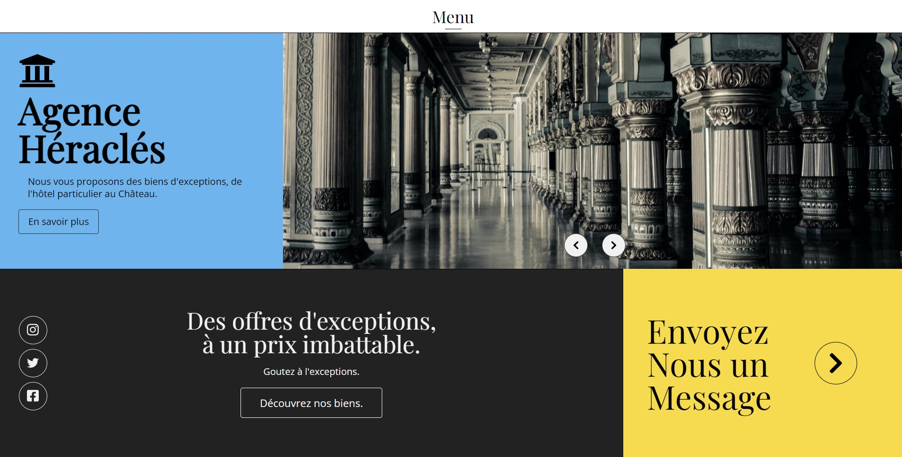

# 3.-State-Agency
##  With CSS and flexbox

#### Real State agency:
The idea here it was to create a nice / responsive landing page and then some simple diferent pages like contact, profil of the agency and a gallery of the houses they are selling. 

## Project Status
The project is finish and i'm moving on to other projets. i'm open to proposition or critics. Feel free to use it and change it as you will. 

## Project Screen Shot(s)

### Samples:   
#### Landing page: 

